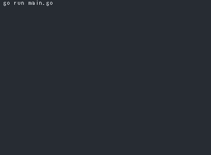

# What is this?
CUI base analog clock written in Golang.

## Joke command developed based on this code
I created joke command based on this code as follows.  
[https://github.com/y-hatano-github/aclock](https://github.com/y-hatano-github/aclock)

## How to get and run the code.
### 1st step
Get the code.
```
go get -d github.com/y-hatano-github/go-clock
```
### 2nd step
Change directory to the source code directory.
```
cd $GOPATH/src/github.com/y-hatano-github/go-clock
```
### 3rd step
Run the code.
```
go run main.go
```

## Key bindings
[esc / CTRL+C] - exit<br>
